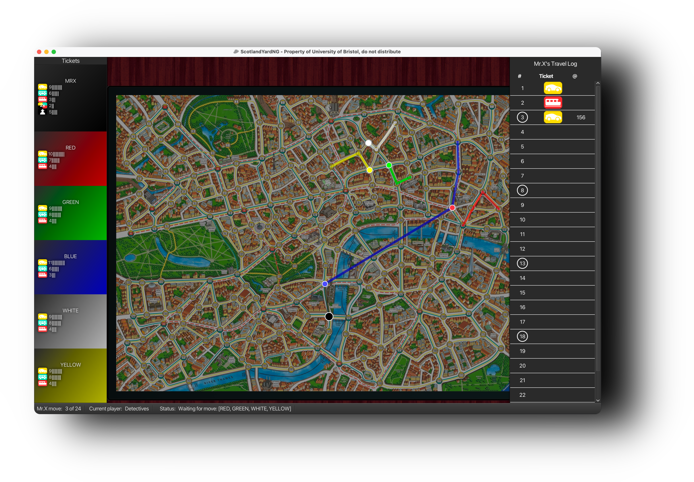

# Scotland Yard AI



AI project for the game **Scotland Yard**, with game assets created by the University of Bristol, featuring multiple algorithms for both Mr. X and the detectives. This project includes multiple AI strategies such as One-Step Lookahead, Paranoid Minimax, Expectimax, and Monte Carlo Tree Search (MCTS) with several enhancements for efficiency and realism.

> [!IMPORTANT]
> This project was submitted as the our final assignment for the first year COMS10018: Object Oriented Programming and Algorithms I module. This repository is for demostration purposes only, please do not copy our code. 

## 📌 Features

- **Multiple AI Strategies**:
  - One-Step Lookahead
  - Paranoid Minimax with Alpha-Beta Pruning
  - Expectimax with tree reduction and random sampling
  - Monte Carlo Tree Search with root parallelisation
- **Optimizations** using:
  - Move Filtering
  - Factory and Singleton Design Patterns
  - Root Parallelisation in MCTS
  - Single Tree Determinisation
  - Coalition Reduction for Detective Coordination

## 🧠 AI Models

### 1. One-Step Lookahead
- Mr. X chooses the move that maximizes distance to the closest detective.
- Detectives minimize total distance to Mr. X’s possible locations.

### 2. Paranoid Minimax
- Depth-limited minimax (6 layers: 1 per player).
- Evaluation combines distance, secret tickets, uncertainty (possible locations).
- Alpha-beta pruning for speedup.

### 3. Expectimax Minimax
- Root-level detective move expands into subtrees for sampled Mr. X locations.
- Uses simplified expectimax (equal weighting).
- Detectives optimize based on sampled locations' subtree scores.

### 4. Monte Carlo Tree Search (MCTS)
- Includes selection (UCT + progressive history), expansion, playout, and backpropagation.
- Intelligent reward propagation and coalition reduction to discourage lazy detectives.
- Root parallelisation and single-tree determinisation for efficient handling of hidden information.

## 📊 Performance & Benchmarks

| Model     | Multi-Threaded |
|-----------|----------------|
| One-Step  | ❌              |
| Minimax   | ✅              |
| MCTS      | ✅              |

### Mr X's Win Rates (Mr. X vs. Detectives)
| Mr X \ Detective | One-Step | Minimax | MCTS |
|-----------|----------|---------|------|
| One-Step  | 40%      | 25%     |  5%  |
| Minimax   | 55%      | 60%     | 10%  |
| MCTS      | 85%      | 80%     | 55%  |

> [!NOTE]
> All values based on 20-game iterations.

## 🛠️ How to Run

1. Clone the repository:
 ```bash
 git clone https://github.com/yourusername/scotland-yard-ai.git
 cd scotland-yard-ai
 ```
2. Run the game:
 ```bash
 cd cw-ai
 ./mvnw clean compile exec:java 
 ```

## 📚 References
- Nijssen, P., & Winands, M. H. M. (2012). *Monte Carlo Tree Search for the Hide-and-Seek Game Scotland Yard*. IEEE Transactions on Computational Intelligence and AI in Games.
